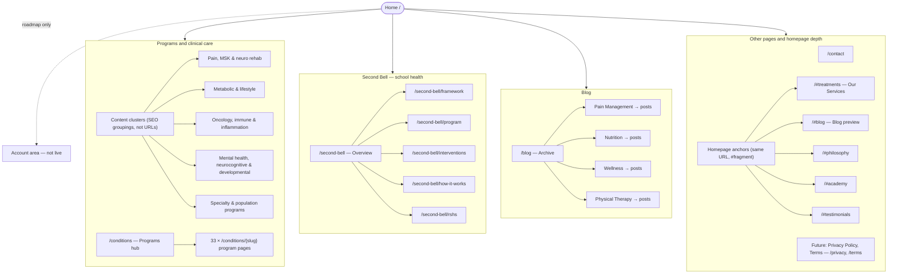

# Recoup Health — high-level site structure (SEO)

**Canonical domain:** `https://recoup.health`  
**Purpose:** Map the live information architecture to a four-branch model (similar to a retail/content template) so SEO planning can cover hubs, clusters, and supporting pages consistently.

**Machine-readable sitemap:** `public/sitemap.xml` (URL list for crawlers). This document is the **strategic / hierarchical** view for workshops and content calendars.

---

## 1. Template alignment

| Template pillar | Recoup Health equivalent | Notes |
|-----------------|-------------------------|--------|
| **Store** (collections → products) | **Programs & clinical care** | Hub at `/conditions`; each program is a **detail URL** `/conditions/{slug}` (33 pages). No separate “collection” URLs today—clusters below are **SEO/content groupings**, not routes. |
| **Account** | **Not in scope (current site)** | No login, profile, or order history. Flag for **future** (e.g. patient portal, appointment history) if product roadmap adds it. |
| **Blog** (categories → posts) | **Blog** | Hub at `/blog`. Posts use **editorial categories** (Pain Management, Nutrition, etc.); categories are **not** separate index URLs yet—plan content and internal linking **as if** they were pillars. |
| **Other pages** | **Conversion & trust** | Contact, homepage sections (anchors), future policy pages. |

---

## 2. Visual hierarchy (Mermaid)

Paste into [Mermaid Live](https://mermaid.live) or any Mermaid-capable doc tool to export PNG/SVG for slide decks.



---

## 3. ASCII tree (quick reference)

```
recoup.health
├── Home (/)
├── Programs & clinical care
│   ├── /conditions                    … hub
│   └── /conditions/{slug}             … 33 program detail pages
│       (group for SEO: Pain/MSK/neuro, metabolic/lifestyle, oncology/immune,
│        mental/developmental, specialty/population — see §4)
├── Second Bell
│   ├── /second-bell
│   ├── /second-bell/framework
│   ├── /second-bell/program
│   ├── /second-bell/interventions
│   ├── /second-bell/how-it-works
│   └── /second-bell/rshs
├── Blog
│   ├── /blog
│   └── /blog/{id}                     … 4 articles (see §5)
├── Other
│   ├── /contact
│   └── /#treatments, /#blog, /#philosophy, /#academy, /#testimonials
└── Account                            … not implemented
```

---

## 4. Program pages — suggested SEO clusters

Use these clusters for **keyword mapping**, **internal linking**, and **content gaps**. Each bullet links to one live `/conditions/{slug}` page.

| Cluster | Program pages (slug) |
|---------|----------------------|
| **Pain, MSK & neuro rehab** | `chronic-pain`, `hypermobility-rehabilitation`, `rheumatological-rehabilitation`, `osteoporosis-rehabilitation`, `spinal-deformity-rehabilitation`, `stroke-rehabilitation`, `traumatic-brain-injury`, `multiple-sclerosis`, `parkinsons-disease` |
| **Metabolic & lifestyle** | `diabetes-program`, `cardiometabolic-program`, `weight-management`, `smoking-cessation-program`, `sleep-circadian-rhythm-clinic`, `gastrointestinal-program`, `hormonal-rebalance-program`, `longevity-program` |
| **Oncology, immune & inflammation** | `cancer-rehabilitation`, `immune-health-program`, `chronic-inflammation-program`, `mold-toxicity-program` |
| **Mental health, neurocognitive & developmental** | `mental-health`, `alzheimers-cognitive-decline`, `autism-spectrum-disorders`, `rasap` |
| **Specialty & population** | `primary-care`, `respiratory-health`, `oral-health`, `infertility-program`, `travel-medicine-clinic`, `geriatrics-program`, `school-health`, `bioenergetics-program`, `stress-positive-relationships-program` |

*Update this table when you add or remove programs in `src/conditions/conditions.js`.*

---

## 5. Blog — categories and posts

| Category (editorial pillar) | Post URL path | Topic |
|----------------------------|---------------|--------|
| Pain Management | `/blog/understanding-rsi` | RSI / wrist pain |
| Nutrition | `/blog/anti-inflammatory-diet` | Anti-inflammatory diet |
| Wellness | `/blog/mind-body-connection` | Mind–body / chronic pain |
| Physical Therapy | `/blog/posture-ergonomics` | Desk ergonomics |

**Strategy note:** If you later add `/blog/category/{name}` index pages, they would sit between `/blog` and individual posts in the hierarchy.

---

## 6. Deliverables checklist for the SEO specialist

- [ ] Align **internal linking** so hub pages (`/`, `/conditions`, `/blog`, `/second-bell`) feed clusters above.
- [ ] Decide whether **category archive URLs** for blog are worth building (currently category exists only in post metadata).
- [ ] Track **Account** / portal URLs separately if product introduces them; update this doc and `sitemap.xml`.
- [ ] Add **Privacy / Terms** when legal pages exist; include in `sitemap.xml` and this tree.

---

*Last updated to match app routes in `src/App.jsx`.*
